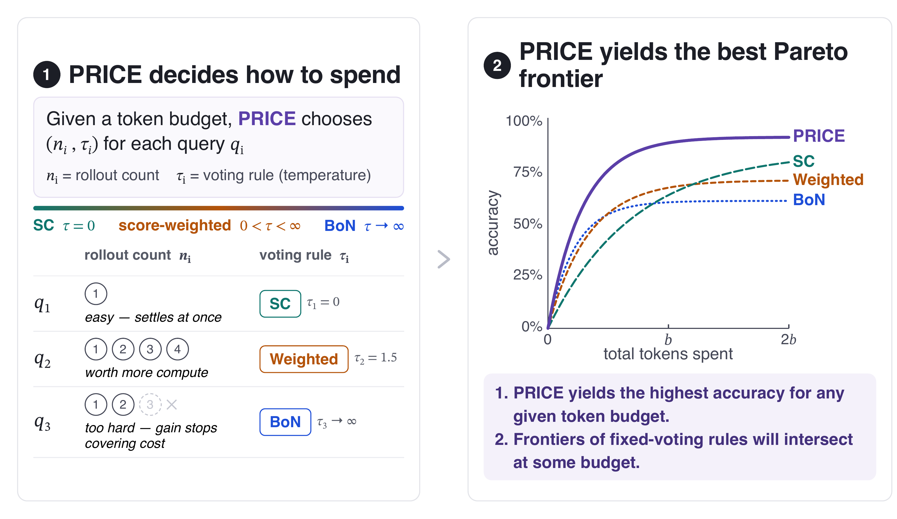
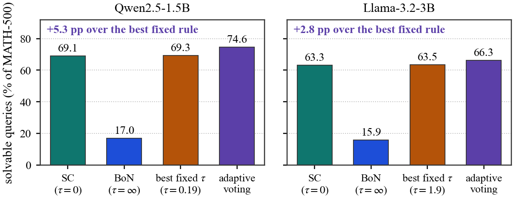
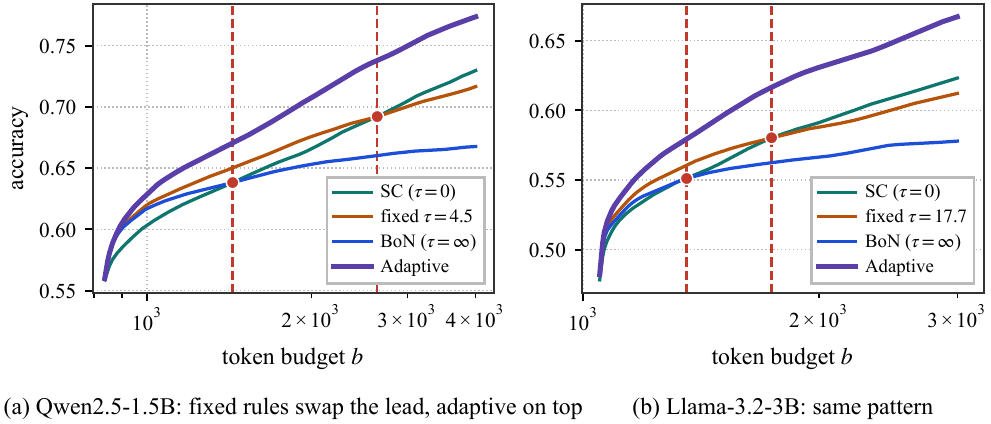
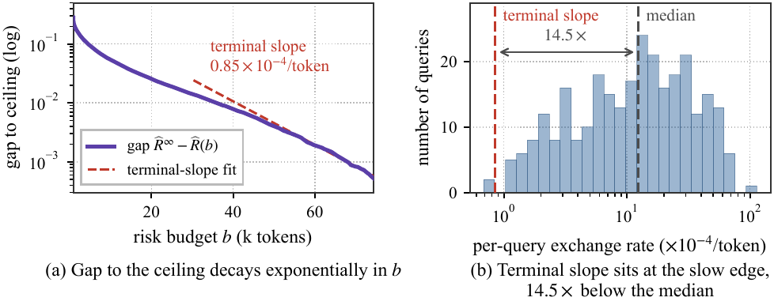
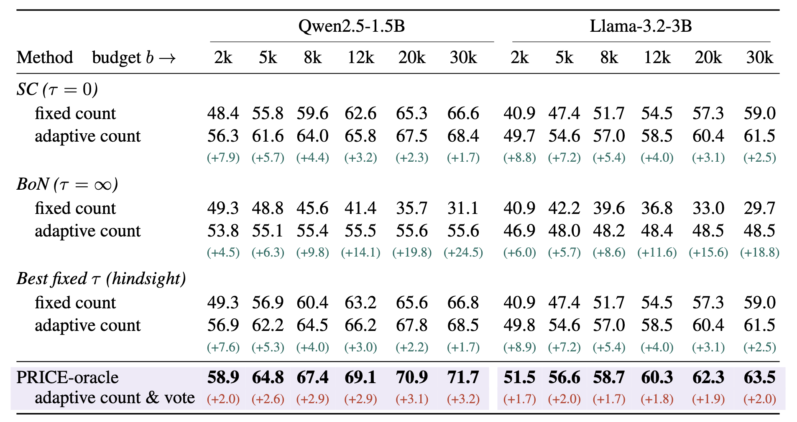
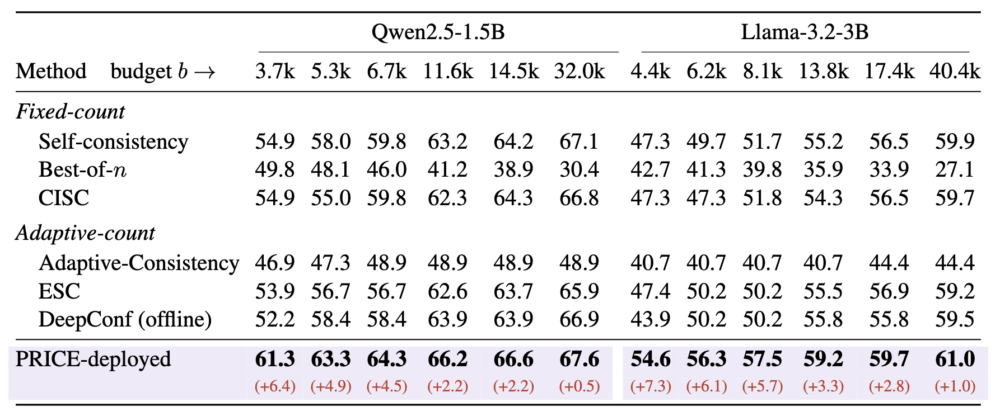
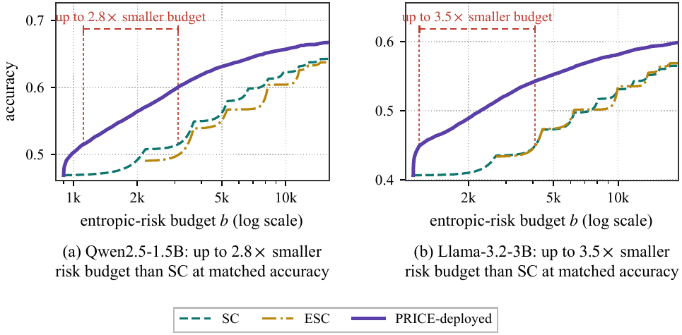

# Pareto Frontier of LLM Test-Time Compute: Adaptive Rollouts and Voting Under Token Budgets

[](#citation)
[](https://huggingface.co/datasets/zach-wang/PRICE-rollouts)
[](LICENSE)

**Zhenyu Wang** (Rutgers University, zw425@stat.rutgers.edu) · **Xiaozhi Zhu** (Meta) · **Yifan Hu** (Rutgers University, yifan.hu@rutgers.edu)

LLM test-time compute improves accuracy by drawing more rollouts and aggregating them with a voting rule. The improvement comes with token costs: every rollout spends tokens, and in practice the tokens come out of a budget that has to cover a whole stream of queries. This work answers the following question.

> [!IMPORTANT]
> **How to adaptively choose the number of rollouts to draw and the voting rule to apply for each query, so that the accuracy is maximized under a token budget?**

**PRICE** (**P**riced **R**ollouts and **I**nference-time voting-rule **C**hoice under a token budg**E**t) adaptively picks the rollout count *and* the temperature that maximize accuracy, query by query, under a pre-specified token budget.

<p align="center"></p>

## Takeaways

**Theory**
1. [Adaptive voting raises the accuracy ceiling.](#1-adaptive-voting-raises-the-accuracy-ceiling) A query is solvable by a voting rule if that rule returns the correct answer given enough rollouts. Choosing the rule per query solves every query that some rule solves, so its ceiling is at least that of any fixed rule.
2. [No fixed rule is best at every budget, so the rule should adapt.](#2-no-fixed-rule-is-best-at-every-budget-so-the-rule-should-adapt) The cost-accuracy frontiers of any two fixed rules can cross, while the adaptive frontier dominates every fixed rule at every budget.
3. [Pareto frontier of LLM test-time-compute has a closed form at large budgets.](#3-the-adaptive-frontier-has-a-closed-form-at-large-budgets) Accuracy converges to its ceiling exponentially, at a rate set by the hardest solvable queries. The data confirm the rate.

**Empirical** (MATH-500, Qwen2.5-1.5B and Llama-3.2-3B)
1. [PRICE-oracle.](#1-price-oracle-how-much-adapting-the-count-and-the-rule-is-worth) Adapting the count is worth 2 to 9 accuracy points at matched budget; adapting the rule adds 2 to 3 points on top of the hindsight-best fixed rule.
2. [PRICE-deployed.](#2-price-deployed-against-six-deployed-methods) Beats six deployed methods at every budget, by +6.4 / +7.3 points at the tightest budgets, and needs up to 2.8× / 3.5× fewer tokens than self-consistency at matched accuracy.

## Theory

### 1. Adaptive voting raises the accuracy ceiling

Under self-consistency, a query $q$ is solvable only when the correct answer is the most frequent one. Under best-of-n, only when its rollouts carry the highest scores. These sets differ, and the set of queries solvable by an adaptive rule is their union over temperatures $τ$, so

$$
\mathbb{P}_q\big[q \text{ is solvable by adaptive voting}\big]\ge\sup_{\tau}\mathbb{P}_q\big[q \text{ is solvable by the fixed rule } \tau\big].
$$

Drawing more rollouts under a fixed rule can never solve a query outside that rule's set; adapting the rule can. On MATH-500 the gap is 5.3 points on Qwen2.5-1.5B and 2.8 on Llama-3.2-3B over the best single temperature, and best-of-n on its own solves fewer than a fifth of the queries. Appendix A of the paper characterizes the consistency sets and when the inequality is strict.

<p align="center"></p>

A query counts as solvable by τ when the vote at τ over its full pool of 128 rollouts is correct, with the P(True) score and the 13-temperature grid of the paper; adaptive voting counts a query when some temperature on the grid solves it (`paper_assets/readme_solvable_fraction.py`).

### 2. No fixed rule is best at every budget, so the rule should adapt

Two theorems make this precise. For any two temperatures there is a query population on which their cost-accuracy frontiers cross, so no fixed temperature is optimal across all populations and budgets. The frontier of adaptive voting, which chooses the temperature per query, dominates every fixed-temperature frontier at every budget. The figure shows both on MATH-500: the best fixed temperature changes at the red markers, and the adaptive frontier lies above all of them.

<p align="center"></p>

### 3. The adaptive frontier has a closed form at large budgets

As the budget grows, accuracy converges to its ceiling exponentially fast, and the rate of that convergence is set by the hardest queries that are still solvable. Easy queries and unsolvable queries saturate early; every extra token then goes to the hardest solvable ones, and how quickly they turn extra tokens into fewer errors is what the whole population's convergence rate inherits.

The data agree. On MATH-500 the gap between PRICE-oracle and its ceiling decays almost linearly on a log scale, and the measured rate sits at the far left of the per-query rates: 14.5× below the median query on Qwen2.5-1.5B, 17.1× on Llama-3.2-3B.

<p align="center"></p>

## Empirical

### 1. PRICE-oracle: how much adapting the count and the rule is worth

PRICE-oracle estimates each query's accuracy curves and cost from a labeled half of its own rollout pool, solves the priced problem, and is evaluated on the other half. It is a benchmark for what joint adaptation can give, not a deployable method. Green numbers are the gain of an adaptive count over a fixed count under the same rule; red numbers are the gain of adapting the rule as well, over the hindsight-best fixed temperature with an adaptive count.

<p align="center"></p>

### 2. PRICE-deployed: against six deployed methods

PRICE-deployed predicts each query's accuracy curves and cost from a labeled calibration corpus (MATH-train) plus label-free statistics of the rollouts drawn so far, refreshes the predictions after every rollout, and stops when the predicted gain over the next few rollouts no longer covers the priced marginal cost. All methods are replayed on the same rollout pools, orderings and horizon with their original voting and stopping conventions. Red numbers are PRICE-deployed minus the best baseline in the column.

<p align="center"></p>

The lead widens as the budget shrinks, from +0.5 / +1.0 points at the loosest budgets to +6.4 / +7.3 at the tightest. On the frontier, PRICE-deployed lies above self-consistency and ESC at every budget and reaches the same accuracy with up to 2.8× (Qwen) and 3.5× (Llama) fewer tokens than self-consistency.

<p align="center"></p>

## How PRICE decides

The whole decision is a few lines. `price/` is a readable numpy implementation of Algorithms 1 and 2 of the paper, and `python -m price.demo` runs it on a three-query toy world: an easy query that settles at once, a query worth more compute, and a hard one whose rollouts stop covering their price.

```python
import numpy as np
from price import estimate_primitives, priced_choice, price_for_budget, should_stop

# PRICE-oracle: primitives from a labeled pool, then one argmax per query at the supporting price
taus = [0.0, 1.0, 3.0, np.inf]                                   # SC, score-weighted, BoN
q = estimate_primitives(answers, scores, lengths, correct="A", taus=taus, gamma=np.log(20) / 1024)
lam = price_for_budget([q, *others], budget=1500, gamma=np.log(20) / 1024, price_grid=np.logspace(-6, -1, 200))
k, n = priced_choice(q.V, q.log_mgf, lam)                        # argmax_{tau, n}  V_tau(n) - lam * M^n

# PRICE-deployed: after each rollout, stop when the predicted gain over the next w rollouts
# no longer covers the priced marginal cost  lam * exp(gamma L_n) * (M_hat - 1)
stop = should_stop(V_hat, n, tokens_so_far, log_mgf_hat, lam, gamma=np.log(20) / 1024, window=4)
```

| File | What it holds | The code that produced the paper's numbers |
|---|---|---|
| `price/vote.py` | the Boltzmann weighted vote (Definition 2.1) | `awv/engine.py` |
| `price/oracle.py` | curve estimation, the priced per-query choice, bisection for the supporting price, the frontier sweep | `experiments/E17_split_joint_oracle/allocation.py`, `experiments/E18_lambda_replay/price_sweep.py` |
| `price/deployed.py` | the look-ahead stopping rule, the cost blend, the online price update | `experiments/E22_ptrue_deployed/controller.py`, `models.py` |

## Reproduce

Every result is a CPU replay over released rollout pools (four cells, 0.8 GB); generation and scoring are the only GPU stages and were run once.

```bash
pip install -r requirements.txt && python scripts/download_data.py
bash experiments/run_all.sh oracle       # PRICE-oracle branch, ~35 min
bash experiments/run_all.sh deployed     # PRICE-deployed branch
bash experiments/run_all.sh paper        # tables and figures into build/
```

[`experiments/README.md`](experiments/README.md) maps every table and figure to the step that produces it, lists the pre-registered protocol of each step, and states what was and was not re-executed after packaging. The oracle branch reproduces the paper's run exactly from the released data.

## Citation

```bibtex
@article{wang2026price,
  title   = {Pareto Frontier of LLM Test-Time Compute: Adaptive Rollouts and Voting Under Token Budgets},
  author  = {Wang, Zhenyu and Zhu, Xiaozhi and Hu, Yifan},
  journal = {arXiv preprint},
  year    = {2026},
  note    = {arXiv identifier to follow}
}
```

## License

Code under the MIT License. Data under CC BY 4.0, with the upstream model and dataset terms in [`DATA_LICENSE.md`](DATA_LICENSE.md).
